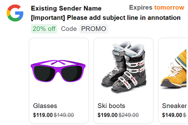
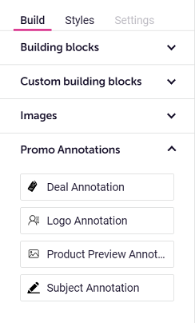
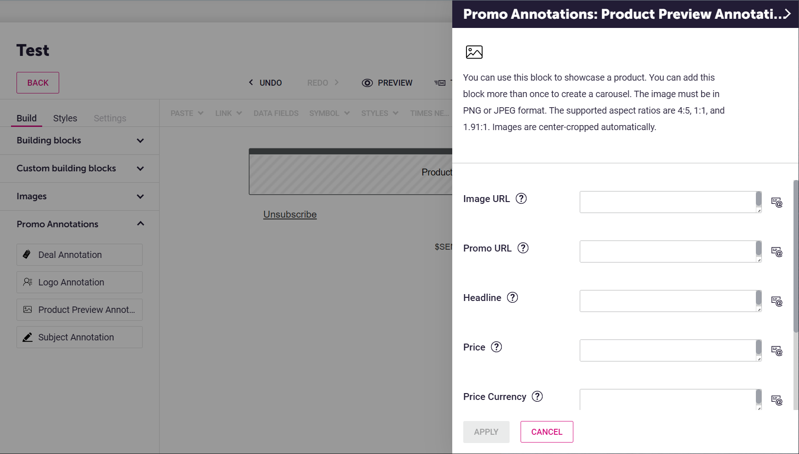
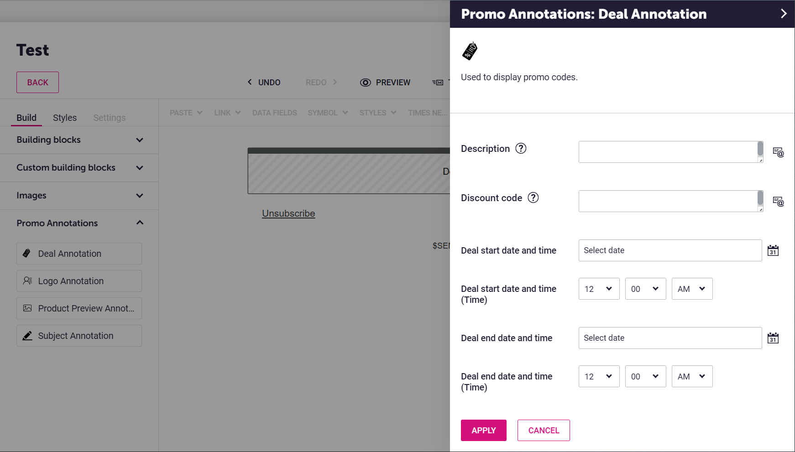
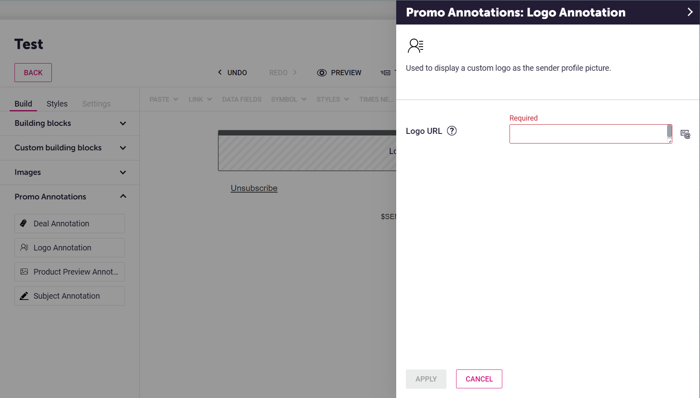
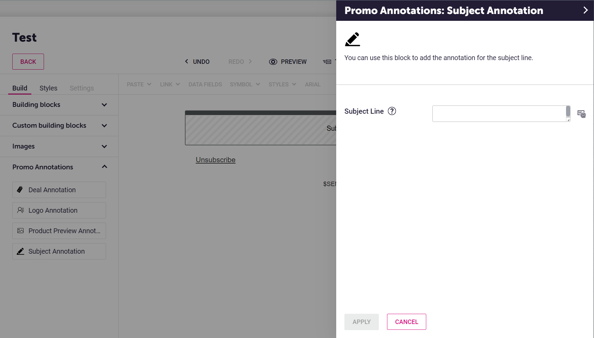

# DotDigital Easy Editor Extension Blocks for Google Promo Tab Features

This is the DotDigital [Easy Editor Extension](https://developer.dotdigital.com/docs/easy-editor-extension-schema) I built which adds no-code blocks in the email editor for configuring and inserting Microdata into emails to utilize [Google Promo Tab features](https://developers.google.com/gmail/promotab/overview) and display rich data in the inboxes as below.

This extension will add the following blocks in your email designer:

## How to Upload this Extension to DotDigital

- Create a `.env` file and fill out your API credentials as shown in `.env.example`,
- Create a Python virtual environment and install the dependencies from `requirements.txt` in it,
  - Windows:
    - `python -m venv env`
    - `env/scripts/activate`
    - `pip install -r requirements.txt`
  - Linux:
    - `python3 -m venv env`
    - `source env/bin/activate`
    - `pip install -r requirements.txt`
- If needed, edit `main.py` to customize the extension blocks,
- Run `main.py`, which makes the API calls to install this extension.

## Using This Extension

Drag and drop the blocks from the newly added Promo Annotations section on the sidebar into the email. When you click on the block you dropped, a configuration menu will appear where you can input the parameters needed for that annotation.

The fields required by the annotation standard are also required in the block configuration forms.

### Product Annotation Block

This block creates a [product preview](https://developers.google.com/gmail/promotab/overview#single-image-preview). If you place more than one of these blocks, they will be shown in a [product carousel](https://developers.google.com/gmail/promotab/overview#product-carousel).

### Deal Annotation Block

This block can be used to add the [deal annotation](https://developers.google.com/gmail/promotab/overview#deal-annotation), which is used to highlight an offer code, its description, and when it expires:

### Logo Annotation Block

This block can be used to customize the sender profile image show in the inboxes:

### Subject Annotation Block

This block can be used to add the annotation for the subject line:

## Testing

The HTML shown in the DotDigital interface will only have placeholder values in the annotations. To confirm the rendering of the previews, send yourself a test email, copy the source code of the mirror page, then paste in [Google's preview tool](https://developers.google.com/gmail/promotab/preview).

The promo tab features may not be displayed in the test emails as they are usually only activated in batch deliveries.
